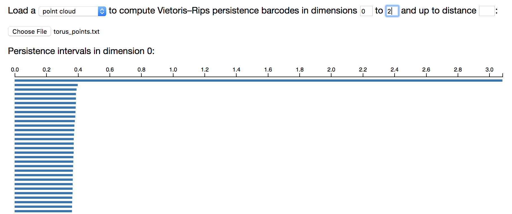
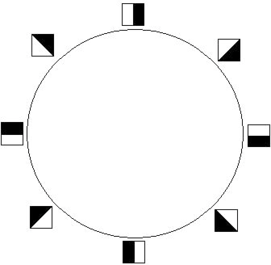
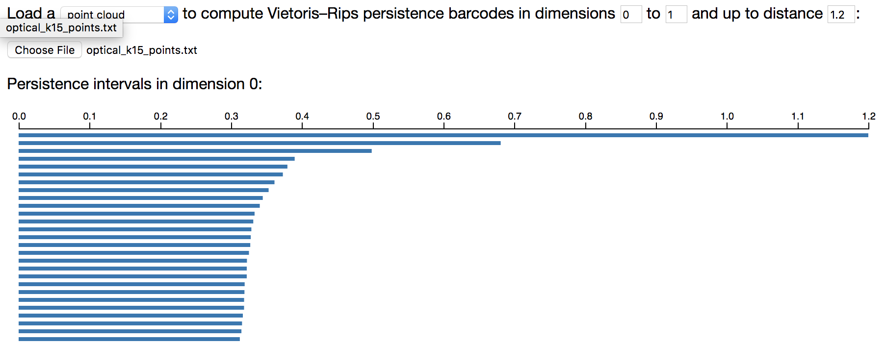

# Persistent Homology Tutorial 1 of 4

(See also [Part 2](persistent-homology-tutorial-2.md),
[Part 3](persistent-homology-tutorial-3.md), and
[Part 4](persistent-homology-tutorial-4.md).)

## Introduction

This tutorial accompanies the chapter on Toplogical Data Analysis in the book
[Data Science for Mathematicians](https://ds4m.github.io).

The tutorial uses code from [Ripser](https://github.com/Ripser/ripser)
by Ulrich Bauer (Bauer, 2015) and a variety of other places,
referenced throughout the text.

This first part of this tutorial (Persistent homology)
requires no software download.
However, you do need to download some datasets, which you can get from
[this folder in the book's GitHub repository](https://github.com/ds4m/ds4m.github.io/tree/master/chapter-10-resources/).

## Persistent homology

You can get the PDF slides for Henry's introduction to persistent homology
[here](https://www.math.colostate.edu/~adams/talks/AnIntroductionToAppliedTopology_Slides_3parts.pdf).

We will be using [Ripser](https://github.com/Ripser/ripser) in this tutorial.
Some slides about how Ripser works are available
[here](http://ulrich-bauer.org/ripser-talk.pdf).

## Ripser in your browser - synthetic examples

The easiest way to run Ripser is in a live demo in your browser, for which no
installation (and in particular, no Python) is required.
[Try it out!](http://live.ripser.org/).

### House example - distance matrix

For example, we can use Ripser to compute the persistent homology of the
Vietoris-Rips complex of the following 5 points in the plane.

The distance matrix for these five points can be downloaded
[here](https://github.com/ds4m/ds4m.github.io/tree/master/chapter-10-resources/distance_matrices/house_distances.txt).
It contains the 5x5 distance matrix corresponding to the collection of 5
points in the plane shown above.  The contents of the file are as follows.

<pre><code class="hljs text">0, 2.0000, 2.8284, 2.0000, 3.1623
2.0000, 0, 2.0000, 2.8284, 3.1623
2.8284, 2.0000, 0, 2.0000, 1.4142
2.0000, 2.8482, 2.0000, 0, 1.4142
3.1623, 3.1623, 1.4142, 1.4142, 0</code></pre>

At the Ripser live webpage, enter the following input (including choosing to
upload that distance matrix file, as shown).

Ripser should give the following output in your browser.

Note that the 5 connected components merge into one,
with merging events happening at scales $\sqrt 2$ and 2.
There is a single 1-dimensional feature, beginning at scale parameter 2 and
ending at scale parameter $\sqrt 8$.

### House example - point cloud

Instead of loading a distance matrix, it is also possible to to load in a set
of points in Euclidean space, listed by their Euclidean coordinates. See, for
example, [this file](https://github.com/ds4m/ds4m.github.io/tree/master/chapter-10-resources/point_clouds/house_points.txt).
It is the $5\times2$ matrix corresponding to the same collection of 5 points
in the plane. To input a point cloud in Ripser live, simply select the option
"point cloud" instead of "distance matrix."
You will get the same output as above!

### Torus example

The following example computes the persistent homology barcodes of a
$20\times20$ grid of 400 points on the unit torus $S^1\times S^1$ in
$\mathbb{R}^4$, where a small amount of noise has been added to each point.
You can download the point cloud data file [here](https://github.com/ds4m/ds4m.github.io/tree/master/chapter-10-resources/point_clouds/torus_points.txt).
Only a subset of the intervals are shown below.

Note that the long barcodes (roughly between scale parameter 0.7 and 1.5)
recover the homology of the torus, with a single connected component, with
two 1-dimensional holes, and with a single 2-dimensional hole.

### Sphere example, with a Python script to create the points

A set of points sampled uniformly at random from the unit sphere can be
downloaded [here](https://github.com/ds4m/ds4m.github.io/tree/master/chapter-10-resources/point_clouds/sphere_points.txt).  But you don't have to use that
particular set of randomly generated points.  You can generate your own, as
follows.

Download and run the Python script
[sphere_points.py](https://github.com/ds4m/ds4m.github.io/tree/master/chapter-10-resources/sphere_points.py).
It will sample 500 points from the unit sphere $S^2$ in $\mathbb{R}^3$,
and then save the point cloud to a text file named `sphere_points.txt`.
(If you have downloaded the entire code repository, you may want to move that
file into the `point_clouds` folder.)

We can compute the persistent homology barcodes in Ripser. So that the
computation finishes, we have asked Ripser to compute only up to scale
parameter 1.2. (One can compute larger examples after downloading Ripser to
one's machine, as in [Part 3](persistent-homology-tutorial-3.md) of this
tutorial.) Only a subset of the intervals are shown below.

Note that the long barcodes (roughly between scale parameter 0.55 and 1.2)
recover the homology of the 2-sphere, with a single connected component,
no 1-dimensional holes, and a single 2-dimensional hole.

### Cyclooctane example

This is an example with a real dataset of cyclooctane molecule conformations.

The cyclooctane molecule consists of a ring of 8 carbon atoms (shown in black),
each bonded to a pair of hydrogen atoms (shown in white).

The cyclooctane molecule C8H16 consists of a ring of 8
carbons atoms, each bonded to a pair of hydrogen atoms. A conformation of this
molecule is a chemically and physically possible realization in 3D space,
modulo translations and rotations. The locations of the carbon atoms in a
conformation determine the locations of the hydrogen atoms via energy
minimization, and hence each molecule conformation can be mapped to a point in
$\mathbb{R}^{24}=\mathbb{R}^{8\times3}$, as there are eight carbon atoms in the
molecule and each carbon location is represented by three coordinates $x,y,z$.
This map realizes the conformation space of  cyclooctane as a subset of
$\mathbb{R}^{24}$.

It turns out that the conformation space is a two-dimensional stratefied space,
i.e., a two-dimensional manifold with singularities.  Furthermore, Brown et al.
(2008), Martin et al. (2010), and Martin and Watson (2011) show that the
conformation space of  cyclooctane is the union of a sphere with a Klein
bottle, glued together along two circles of singularities.  (See Chapter 10 of
[Data Science for Mathematicians](https://ds4m.github.io/) for more detail, or
Figures 7 and 8 in Martin and Watson (2011).) Indeed, the algorithm they
develop allows them to triangulate this conformation space from a finite
sample.

Zomorodian (2012) uses the cyclooctane dataset as an example to show that we
can efficiently recover the homology groups of the conformation space using
persistent homology. In this section we essentially follow Zomorodian's
example. We begin with a sample of 1,000 points on the conformation space.
(This data is publicly available at [Shawn Martin's webpage](https://www.sandia.gov/smartin/software.html).)
We then compute the resulting persistent homology. We obtain the Betti numbers
$b_0=b_1=1$ and $b_2=2$, which match the homology groups of the union of a
sphere with a Klein bottle, glued together along two circles of singularities.

The following example computes the persistent homology barcodes of 1,000 points
from the configuration space of cyclooctane molecules in $\mathbb{R}^{24}$.
This dataset is available [here](https://github.com/ds4m/ds4m.github.io/tree/master/chapter-10-resources/point_clouds/cyclooctane_points.txt).

So that the computation finishes, we have asked Ripser to compute only up to
scale parameter 1.3. (One can compute larger examples after downloading Ripser
to one's machine, as in [Part 3](persistent-homology-tutorial-3.md) of this
tutorial.) Only a subset of the intervals are shown below.

The long barcodes (roughly between scale parameter 0.65 and 1.25), with one
connected component, one 1-dimensional hole, and two 2-dimensional holes, match
the homology of the union of a sphere with a Klein bottle, glued together along
two circles of singularities.

### Optical image patch example

This is an example with a real dataset of optical image patch data.

The optical image database collected by van Hateren and van der Schaaf (1998)
contains black and white digital photographs from a variety of indoor and
outdoor scenes. Lee et al. (2003) study $3\times3$ patches from these images,
and Carlsson et al. (2008) continue the analysis of image patches using
persistent homology. Carlsson et al. (2008) begin with a large collection of
high-contrast, normalized $3\times3$ pixel patches, each thought of as a point
in $\mathbb{R}^9$. They change to the Discrete Cosine Transform (DCT) basis,
which maps the patches to the unit sphere $S^7$ in $\mathbb{R}^8$.  They select
from this space the 30% densest vectors, where density is based on the distance
from a point to its 300th nearest neighbor. In Carlsson et al.  (2008), this
dense core subset is denoted $X(300,30)$. In the next example we verify the
result from Carlsson et al. (2008): $X(300,30)$ has the topology of a circle.

The following example computes the persistent homology barcodes of 1,000 points
from $X(300,30)$.
The dataset can be downloaded [here](https://github.com/ds4m/ds4m.github.io/tree/master/chapter-10-resources/point_clouds/optical_k300_points.txt).

So that the computation finishes, we have asked Ripser to compute only up to
scale parameter 1.3. (One can compute larger examples after downloading Ripser
to one's machine, as in [Part 3](persistent-homology-tutorial-3.md) of this
tutorial.) Only a subset of the intervals are shown below.

The long barcodes (roughly between scale parameter 0.5 and 1.25), with one
connected component and one 1-dimensional hole, have the homology of a circle.
This is good evidence that the core subset $X(300,30)$ is well-approximated by
a circle.

We plot the projection of these points onto the first two linear gradient
Discrete Cosine Transform basis vectors.

The projection of $X(300,30)$ above shows a circle. It is called the optical
primary circle and is parameterized as shown below.

We can also consider the 3-circle model, which arises from the dataset
$X(15,30)$ that corresponds to a more local estimate of density.
The dataset can be downloaded [here](https://github.com/ds4m/ds4m.github.io/tree/master/chapter-10-resources/point_clouds/optical_k15_points.txt).

So that the computation finishes, we select only 1,000 points from $X(15,30)$,
and we have asked Ripser to compute only up to scale parameter 1.2. (One can
compute larger examples after downloading Ripser to one's machine, as in
[Part 3](persistent-homology-tutorial-3.md) of this tutorial.) Only a subset of
the intervals are shown below.

The barcodes with one connected component and five 1-dimensional holes
correspond to the 3-circle model for the core subset $X(15,30)$. Much more
convincing (longer) intervals can be obtained by using more points and
computing with Ripser downloaded to your local machine.

We plot the projection of these points onto the first two linear gradient
Discrete Cosine Transform basis vectors.

The corresponding three-circle model for optical images is shown below.

---

(See also [Part 2](persistent-homology-tutorial-2.md),
[Part 3](persistent-homology-tutorial-3.md), and
[Part 4](persistent-homology-tutorial-4.md).)
